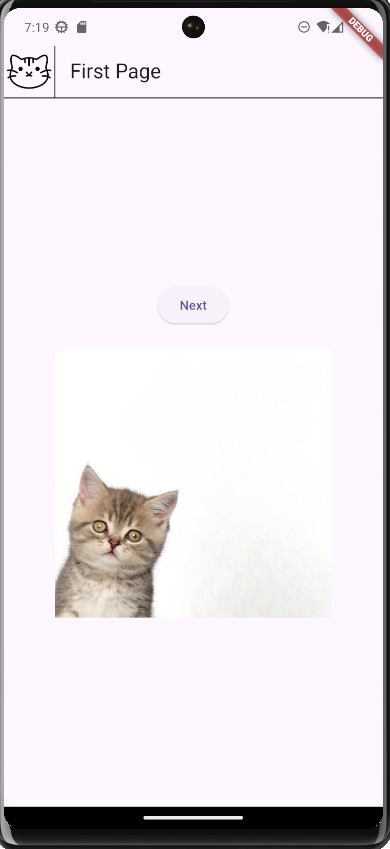
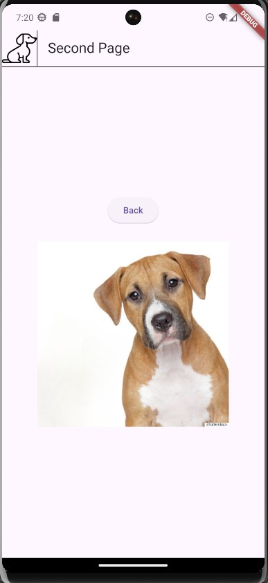

<aside>
🔑 <strong>PRT(Peer Review Template)</strong>

    # AIFFEL Campus Online Code Peer Review Templete
- 코더 : 김민규
- 리뷰어 : 김우찬

- [X]  **1. 주어진 문제를 해결하는 완성된 코드가 제출되었나요?**
    - 문제에서 요구하는 기능이 정상적으로 작동합니다.
        -   
    -  또한 아이콘 사용, 칸막이 사용등 잘 적용해주셨습니다.
    
- [ ]  **2. 핵심적이거나 복잡하고 이해하기 어려운 부분에 작성된 설명을 보고 해당 코드가 잘 이해되었나요?**
    - 코드에 충분한 주석이 달려있지는 않습니다.
    - 하지만 민규님 평소 프로그래밍 실력을 생각한다면, 잘 알고 작성해주셨을 것으로 추정 가능합니다.
        
- [X]  **3.** 에러가 난 부분을 디버깅하여 “문제를 해결한 기”을 남겼나요? 또는
   “새로운 시도 및 추가 실험”을 해봤나요? ****
    - 변수 초기화 하는 과정을 setState와 if != null을 사용하여 isCat을 false로 하는 과정이 인상적이었습니다.
        
- [X]  **4. 회고를 잘 작성했나요?**
    - GPT를 주로 사용하셨고(이건 PRT를 같이하는 은비님, 민규님, 우찬 모두 동일함), 그 외에 추가적으로 수정했던 부분에 대해 구두로 회고를 잘 말씀해주셨습니다.

- [X]  **5. 코드가 간결하고 효율적인가요?**
    - 코드가 140줄 정도로, 제 코드에 비해 간결하다고 판단합니다.
     
# 회고(참고 링크 및 코드 개선)
```
#
김우찬 : 결석 많이하셔서 걱정했는데 와주셔서 감사해요 민규님. 하핳
- 코드도 잘 작성해주신 것 같습니다. 다만, 저와 같은 초보자를 위해 코드에 주석을 조금 더 상세히 달아주시고, 전체 회고를 기록으로 작성해주시면 감사하겠습니다. 수고 많으셨습니다.
# 
```
    
</aside>

